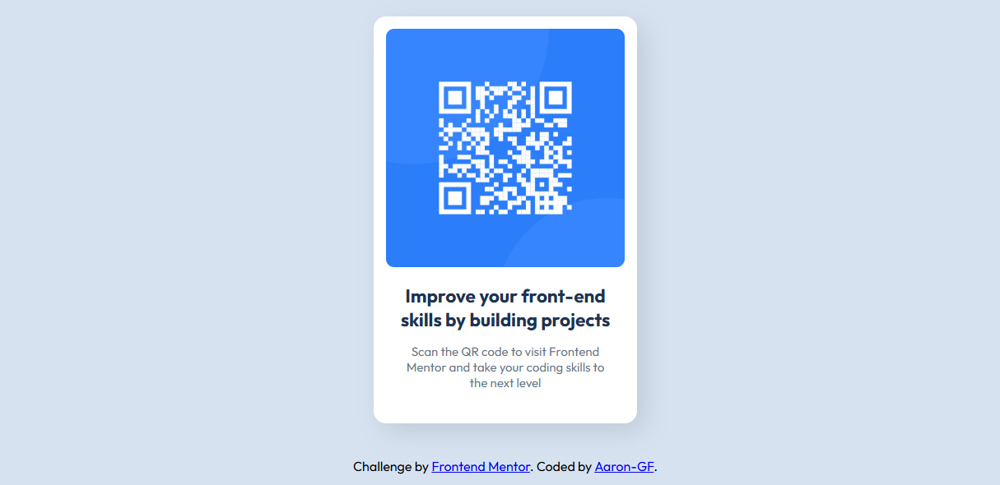

# Frontend Mentor - QR code component solution

This is a solution to the [QR code component challenge on Frontend Mentor](https://www.frontendmentor.io/challenges/qr-code-component-iux_sio_h).  
This challenge helped me improve my layout skills and styling with HTML and CSS.

---

## Table of Contents

- [Overview](#overview)  
  - [Screenshot](#screenshot)  
  - [Links](#links)  
- [My process](#my-process)  
  - [Built with](#built-with)  

---

## Overview

### Screenshot

---

### Links

- Solution URL: [GitHub Repo](https://github.com/aaron-gf/qr-code-component-Main)  
- Live Site URL: [GitHub Pages](https://aaron-gf.github.io/qr-code-component-Main/)  

---

## My process

### Built with

- Semantic HTML5 markup  
- CSS custom properties  
- Flexbox  
- Mobile-first workflow  
